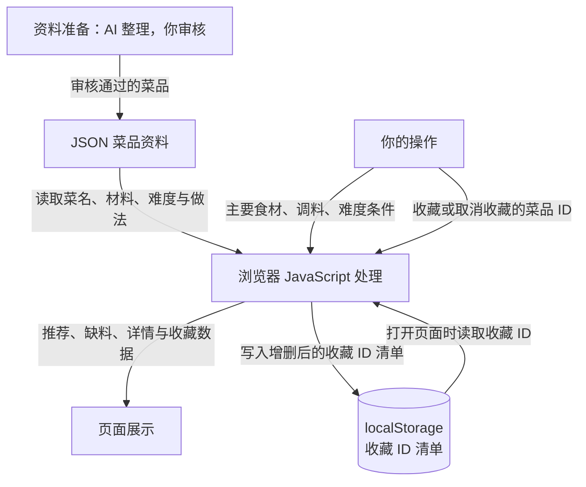

# Day 5｜个人选菜工具技术设计

初稿日期：2026-09-20；数据流图补充日期：2026-09-21。

项目仓库：My-first-Ku。需求依据：PRD.md；本设计不改变其中的功能范围和验收标准。

阶段：板块③，方案 A 的技术设计与数据流图已编写，待用户核对。本文是开发前的设计，不代表功能已经实现。

## 1. 已确认的技术路线

**技术路线：HTML + CSS + JavaScript + Vite + JSON 菜品文件 + localStorage；不建业务后端和服务器数据库。**

“技术栈”就是项目组合使用的一套技术。这里的前端负责显示与计算，JSON 文件提供经审核的菜品，浏览器本地保存收藏，Vite 帮助开发预览和打包。

## 2. 数据流图

下图说明拟实现的数据流向。资料准备发生在发布前，不是每次点击推荐时调用 AI。

看图时注意：

- 菜品资料与用户选择是两个输入；浏览器按 PRD 规则计算，结果显示在页面上。
- 收藏只保存菜品 ID，不保存整份菜谱；显示收藏列表时，需要结合 JSON 菜品资料找到相应菜名和详情。
- 收藏或取消收藏写入成功后，才更新对应的成功状态；图示正常数据流，失败处理见第 6.2 节，保存范围见第 7 节。
- 用户的选择和收藏不发往 GitHub，也没有业务后端接收；网站文件本身仍需由本地预览服务或正式网站服务提供。

用一句话概括本设计：菜品来自 AI 整理并经我审核的资料文件，浏览器结合我选择的食材和难度生成推荐，收藏编号保存在当前站点的浏览器本地，下次打开时再读取显示。

## 3. 为什么暂时选择 A

- 当前只为自己选菜，核心是按食材与难度筛选、查看详情、收藏与取消收藏；这些处理可以在浏览器内完成。
- PRD 明确不做登录和跨设备同步，因此首版不需要为这些功能建立业务后端或服务器数据库。
- 第一批菜品由 AI 整理、用户审核，适合先作为随网站提供的固定资料，而不是接入实时菜谱服务。
- 收藏只需记录少量菜品的标识，选择浏览器本地保存，与“当前设备、当前浏览器内保留”的要求一致。
- 与 React 方案相比，原生网页路线少一套组件和状态管理的学习要求。代价是页面交互变复杂后，需要自行组织页面更新与数据状态；不是认为 React 不好，而是当前范围并不要求它。

这是基于当前 PRD 的适配判断，不是永远不能换路线。以后如有新需求，先确认范围，再评估是否调整，不提前实现。

## 4. 各项技术负责什么

| 技术或部分 | 在本项目中的职责 |
| --- | --- |
| HTML | 组织食材选项、推荐结果、详情和收藏列表等页面内容。 |
| CSS | 控制页面布局、文字和按钮外观。 |
| JavaScript | 处理选择与点击，执行匹配、缺料计算、排序，以及收藏读写和页面更新。 |
| Vite | 开发时提供本地网页预览；发布前把项目整理为可供浏览器使用的静态文件。不是处理用户数据的业务后端。 |
| JSON 菜品文件 | 用统一的文字格式保存经用户审核的菜品资料，供页面读取；不是服务器数据库。 |
| localStorage | 浏览器提供的本地保存能力，用来保留收藏记录；不是云端备份。 |
| 业务后端、服务器数据库 | 首版不建立。仍需通过本地预览服务或正式网站服务提供网页文件，“没有业务后端”不等于“没有文件服务”。 |

技术说明依据：[MDN 网页基础](https://developer.mozilla.org/en-US/docs/Learn_web_development/Getting_started/Your_first_website)、[Vite 官方入门](https://vite.dev/guide/)。React 备选路线的组件概念见 [React 官方入门](https://react.dev/learn)；本次未选择该路线。

## 5. 数据从哪里来，保存在哪里

| 数据 | 来源 | 保存和使用位置 |
| --- | --- | --- |
| 菜品资料 | AI 先整理家常菜，由用户审核材料划分、难度与做法。 | 审核通过后存入项目的 JSON 菜品文件，随网站发布，浏览器读取用于筛选和详情展示。 |
| 已有主要食材、已有调料、难度条件 | 用户在页面上勾选或选择。 | 仅保存在当前页面运行期间的临时状态中，供本次推荐使用；首版不新增跨次打开记忆筛选条件的功能。 |
| 推荐结果与缺料提示 | JavaScript 根据菜品资料和用户条件计算。 | 在页面中显示，不单独永久保存；条件修改后重新计算，不能把旧结果当作新结果。 |
| 收藏记录 | 用户执行收藏或取消收藏。 | 将去重后的菜品 ID 清单保存到当前站点的 localStorage；重新打开时读取，并与菜品资料对应，显示收藏列表和状态。 |

“菜品 ID”是每道菜固定的识别编号，不是列表中的位置。修改排序或菜名不应随意改变这个编号，避免收藏指向错误菜品。

每道菜的资料至少包含：固定 ID、菜名、主要食材、调料、难度、做法步骤。材料使用统一名称、分组一致并去重；具体菜品和用量仍由用户审核，不在 Day 5 生成菜品库。

菜品资料与收藏分开：菜品文件是所有使用者拿到的基础资料，收藏是这个浏览器的个人记录。点击收藏不会修改项目文件，也不会自动上传到 GitHub。

## 6. 处理规则与 PRD 的对应关系

### 6.1 推荐、详情与缺料提示

由浏览器中的 JavaScript 执行，保持 PRD 第 4 节的规则：

- 至少选择一种主要食材才能推荐；候选菜至少用到一种已选主要食材，且最多缺两种主要食材。
- 缺少主要食材按不同种类计数，调料单独提示，不影响准入、不参与排序。
- 难度只保留简单、普通两档；不限包括两档，选择普通只匹配普通菜。
- 先按缺少主要食材的种数排序，相同则简单在前；不为了凑结果自动放宽条件。
- 详情展示完整材料与做法；从推荐进入时使用该次有效条件。没有有效条件时不虚构缺料或齐全结论。

这是按确定规则筛选，不需要每次选菜时调用在线 AI。AI 整理菜品发生在资料准备阶段，不是每次用户点击推荐时发生。

### 6.2 收藏、取消收藏与保存失败

- 页面打开时读取收藏记录；用菜品 ID 与菜品资料对应，不在本地收藏中重复保存整份菜谱。
- 收藏时加入 ID 并去重；取消收藏时移除 ID。保存成功后同步更新详情与收藏列表，不删除原菜品。
- 收藏列表不受当前推荐筛选条件限制，也不要求先选择食材。
- 读取失败或记录无法识别时，提示问题，不直接当成空列表并覆盖原记录；正常没有收藏时才显示空收藏提示。
- 写入失败时，不把临时页面变化说成“已保存”；保留上次确认的保存状态，提示失败并允许重试。

以上设计分别对照 PRD 的 A01–A10（推荐与详情）、A11–A15（收藏和异常）、A16（菜品审核）。这里只检查设计与需求对应，不声称这些功能已经通过测试。

## 7. 浏览器保存的限制与开发方式

localStorage 能跨正常浏览器会话保存数据，但受站点来源和浏览器策略限制。依据：[MDN localStorage 文档](https://developer.mozilla.org/en-US/docs/Web/API/Window/localStorage)。

- 收藏范围实际是同一设备、同一浏览器用户配置中的同一站点来源；站点来源由协议、域名和端口共同决定。只改变页面路径通常不会换一份存储。
- 开发预览地址与正式网站地址的收藏各自独立，不自动迁移；改变协议、域名或端口，也不会自动读取原来的收藏。
- 清除该网站的数据会清除其本地收藏；换浏览器或设备不能自动同步。隐私模式、浏览器限制等情况下不能保证保留。
- 开发阶段通过 Vite 的固定本地预览地址访问，不依赖双击 HTML 文件的方式验证收藏，因为直接打开本地文件时的存储行为没有统一保证。
- 正式发布使用构建后的静态文件，不把 Vite 开发预览服务直接当正式网站。Node.js 和 npm 在本路线中用于开发工具，不承担线上选菜或收藏的业务处理。
- 今天不安装依赖、不启动项目、不决定托管服务。具体依赖版本在获准开发时核对并锁定，不能仅凭本文认为环境已经验证通过。

## 8. 数据维护与安全边界

- 修改正式菜品时，需要更新经审核的资料文件并重新发布；首版不增加在线菜品管理后台。
- 本地保存使用本项目专用的存储名称，避免同一站点下其他项目混用收藏；不擅自清空整个站点的本地数据。
- 前端文件和随网站提供的菜品资料对获得网站访问权限的人可见，不放密钥、数据库连接串或私人信息。
- GitHub 仓库设为私有，不代表以后发布的网站自动具有访问限制；正式发布时需另行确认访问范围。
- 本路线不需要数据库连接配置或在线 AI 密钥，不新建 .env；继续保留现有忽略规则。

## 9. 板块③完成后的状态

以下是本步骤结束时的记录，不代表此后仓库的实时状态：

- 已完成：用户选择方案 A，文档记录技术路线、选择理由、数据安排与限制；第 2 节已补入数据流图和一句话说明。
- 待用户核对：第 1 节技术路线与第 2 节图中的来源、处理、保存和读取方向是否清楚；在支持 Mermaid 的 Markdown 预览中确认图能显示。
- 尚未完成：最终截图、提交前核对、Git 提交与推送。尚未收到截图保存的证据。
- 本步只补充 TECH_DESIGN.md；Day 5 相对仓库已提交版本仅新增该文档，不修改 PRD.md，不创建功能代码、菜品文件或其他配置文件。

全日内容核对完成后，收到“进入下一板块”再列出文件清单与提交信息；仍须等用户确认后才能提交和推送。
